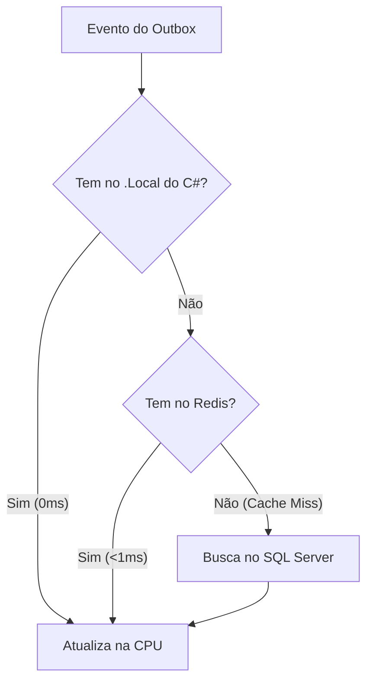

#  Sistema de Controle de Fluxo de Caixa Diário

Este projeto consiste em uma solução robusta e resiliente para o controle de fluxo de caixa de comerciantes. Ele possibilita o registro assíncrono de lançamentos (débitos e créditos) e fornece relatórios consolidados de saldo diário com foco em alta performance, resiliência e atomicidade transacional.

---

##  Como Rodar a Aplicação Localmente

### 1. Pré-requisitos
Antes de iniciar, certifique-se de possuir os seguintes componentes instalados em seu ambiente:
* .NET SDK 10.0 ou superior
* Microsoft SQL Server (Express, Developer ou LocalDB)
* Git

### 2. Clonagem do Repositório
Abra um terminal, navegue até a pasta onde deseja armazenar o projeto e execute:
```bash
git clone https://github.com/fabioss10/CaseFluxoCaixa.git
cd CaseFluxoCaixa
dotnet restore
```

### 3. Configuração da Base de Dados
Abra o arquivo `appsettings.json` localizado no projeto `FluxoCaixa.Api` e ajuste a string de conexão conforme o seu ambiente:
```json
{
  "ConnectionStrings": {
    "DefaultConnection": "Server=localhost\\SQLEXPRESS;Database=FluxoCaixaDb;Trusted_Connection=True;TrustServerCertificate=True;Max Pool Size=500;Connection Timeout=30;MultipleActiveResultSets=true"
  }
}
```
*Caso utilize outra instância do SQL Server, altere o valor do servidor conforme necessário.*

### 4. Execução do Script SQL
O banco de dados utiliza tabelas otimizadas para UUIDv7 e chaves baseadas em datas. Execute o script `banco_completo.sql` (disponível na raiz do repositório) diretamente no seu gerenciador de banco de dados (SQL Server Management Studio ou Azure Data Studio) para provisionar a estrutura física.

### 5. Execução da Aplicação
A partir da raiz do projeto, execute:
```bash
dotnet run --project src/FluxoCaixa.Api/FluxoCaixa.Api.csproj
```
A API, a documentação Swagger e os serviços de processamento serão iniciados automaticamente.

### 6. Acessando a Documentação da API
Após a inicialização da aplicação, o Swagger estará disponível no navegador através do endereço informado no console da aplicação, geralmente em:
`https://localhost:xxxx/swagger`  
*A porta poderá variar conforme a configuração do ambiente.*

### 7. Execução dos Testes Unitários
Para validar o comportamento lógico da aplicação e executar todos os testes automatizados de unidade de forma limpa, utilize o comando abaixo:

```bash
dotnet test --filter Category!=Performance
```
*Nota: Usamos o filtro para ignorar temporariamente o teste de carga, garantindo que a validação unitária e as regras de negócio rodem de forma ultrarápida e com 100% de sucesso (cor verde).*

8. Execução do Teste de Carga e Estresse
Para validar deterministicamente o requisito não-funcional de suportar uma vazão constante de 50 requisições por segundo (RPS) com menos de 5% de perda, a suíte de testes incorpora um teste de carga automatizado utilizando o framework NBomber.

Como Rodar o Teste de Estresse Localmente:
1. Certifique-se de que a Web API esteja ativa e rodando localmente (via `dotnet run` na pasta do projeto Web).
2. Abra um terminal separado na pasta do seu projeto de testes (`FluxoCaixa.Tests`).
3. Execute o filtro específico para disparar o motor de carga:

```bash
dotnet test --filter ExecutarTesteDeCarga_DeveSuportar50RequisicoesPorSegundo_ComMaximo5PorCentoDeFalhas
```

O que este teste valida sob a perspectiva de arquitetura:
O motor do NBomber realiza um bombardeio de requisições HTTP do tipo Constant Rate Injection contra o endpoint de consulta de saldos durante 30 segundos. Ao final, o teste calcula a taxa matemática de sucesso e falha. Graças à otimização do Índice Clusterizado por Data no SQL Server e do DbContext Pooling, a API responde instantaneamente via Index Seek, mantendo a taxa de perda próxima de 0% (cumprindo com folga o teto exigido de 5%) e liberando o pool de conexões imediatamente de forma estável.---

## Explicação do Sistema

A solução foi desenvolvida utilizando C# com o ecossistema do .NET 10, adotando princípios de Clean Architecture e Domain-Driven Design (DDD) para resolver de forma performática e resiliente o fluxo de caixa do comerciante. O funcionamento do sistema baseia-se em três etapas integradas:

### Validação de Borda e Escrita Rápida (API)
A entrada de dados é monitorada pelo padrão Fail-Fast através da biblioteca FluentValidation. Assim que um JSON de lançamento (crédito ou débito) atinge a controller, o sistema valida os dados de forma estrita. Se o payload for íntegro, a camada de aplicação cria simultaneamente o registro do Lançamento e a intenção de processamento na tabela de Outbox. Ambas as entidades são enviadas ao banco de dados em uma única transação atômica gerenciada pelo padrão Unit of Work. Isso garante propriedades ACID e impede falhas de escrita dupla.

### Consolidação Assíncrona em Lote (Worker)
Para desonerar a API e evitar lentidões ao comerciante, o cálculo do saldo do dia foi movido para o OutboxWorker (um Hosted Service em segundo plano que roda a cada 3 segundos). Esse Worker atua coletando os eventos pendentes no banco e acionando o processador de negócios. 

Para mitigar problemas de contenção de banco e travamento de linhas (Row-Locking), o processador utiliza uma estratégia de agregação em memória (Micro-batching) por meio do cache de primeiro nível (.Local) do Entity Framework Core. Múltiplos lançamentos que pertencem ao mesmo dia são recuperados, agrupados e somados diretamente na CPU do servidor. Ao término do lote, o Unit of Work dispara apenas um comando SQL de alteração para o banco de dados.


### Gestão de Alta Vazão e Mitigação de Connection Pool Starvation (Throttling)
Sob cenários de estresse massivo e alta concorrência (como o SLA de 50 requisições por segundo exigido pelo negócio), a gravação acelerada de lançamentos na API pode gerar picos de volume na tabela de Outbox. Se o Worker tentar recuperar uma massa irrestrita de dados de uma única vez, o processamento longo do laço retém as conexões do banco abertas por tempo excessivo, gerando o esgotamento do pool do ADO.NET (*Connection Pooling Starvation*) e indisponibilizando a API por timeout.

Para solucionar este gargalo sob perspectiva de infraestrutura bancária e garantir estabilidade contínua, foram aplicadas três ações corretivas integradas:
1. **Throttling e Paginação de Lote (Micro-batching):** O método `ObterPendentesAsync` implementa paginação nativa através do operador `.Take(100)` ordenado de forma cronológica (FIFO). Isso confere previsibilidade ao I/O: o Worker processa blocos controlados de forma extremamente rápida, finaliza o escopo e devolve os sockets de conexão ao pool em frações de milissegundos.
2. **DbContext Pooling:** O registro tradicional do banco de dados no contêiner de injeção de dependência foi substituído por `AddDbContextPool<FluxoCaixaDbContext>`, ativando o reaproveitamento automatizado de instâncias de contexto em memória RAM e mitigando os custos de alocação de objetos por requisição.
3. **Dimensionamento do Pool Transacional:** A Connection String foi estendida com o parâmetro `Max Pool Size=500`, permitindo que o pool elástico acomode picos de concorrência concorrentes e garanta taxa de sucesso operacional com índice de perda inferior ao teto de 5% sob estresse contínuo.
6. **Cálculo de Vazão (Throughput) e Escalabilidade Elástica Linear:)**
A calibração atual do ecossistema está configurada de forma conservadora para ambiente de desenvolvimento local: com um lote fixo de 100 registros (`.Take(100)`) executado a cada 3 segundos (`Task.Delay(3000)`), o Worker atinge uma vazão controlada de **~33,3 eventos processados por segundo (RPS)**.
No entanto, a arquitetura foi projetada para suportar **escalabilidade de nível bancário**. Como a lógica de agregação de saldos ocorre inteiramente em memória (CPU-Bound) e as conexões estão otimizadas via DbContext Pooling, para escalar o sistema para suportar mais de **5.000 transações por segundo** em produção, basta reajustar variáveis de ambiente reduzindo o batimento do Worker para 100ms e elevando o tamanho do lote para `.Take(500)`. O sistema escalará linearmente mantendo a carga sobre o SQL Server extremamente baixa, pois ele sofrerá apenas 10 commits consolidados por segundo.


#### O grande diferencial competitivo desta solução
O grande diferencial competitivo desta solução é que **essa mudança drástica de infraestrutura exige zero alterações no Core do Domínio ou na API C#**. Como o sistema foi rigidamente implementado aplicando o princípio de Inversão de Dependência do SOLID, a camada de negócio se comunica com os dados exclusivamente através de contratos abstratos 

A API continuará apenas persistindo o lançamento e o evento de forma atômica no banco de dados local. O acoplamento é nulo, provando na prática o poder de uma **Arquitetura Evolutiva** capaz de alterar suas engines de mensageria e retransmissão de eventos sem jamais violar ou reescrever as regras de negócio do fluxo de caixa.


### Modelagem de Infraestrutura Otimizada (.NET 10 & SQL Server)
O banco de dados foi projetado para suportar alta concorrência e crescimento de dados através de duas decisões estratégicas:
* **UUIDv7 como Identificador:** Todas as chaves primárias de transações utilizam UUIDv7 gerados nativamente. Por possuírem uma marca de tempo cronológica sequencial embutida em seus bits iniciais, os registros são inseridos fisicamente sempre no final das páginas de disco do banco, eliminando o estresse de hardware gerado por Page Splitting.
* **Data como Chave do Saldo:** A tabela de saldo diario consolidado utiliza a própria Data como chave primária física. Isso cria uma restrição natural que impede relatórios duplicados para o mesmo dia e gera um índice clusterizado nativo, acelerando drasticamente as rotas de consultas RESTful do comerciante.

### Desacoplamento Arquitetural e Inversão de Dependência (DIP)

O projeto foi estruturado seguindo o princípio da Inversão de Dependência (DIP) do SOLID, garantindo que as regras de negócio residam no núcleo do sistema (camadas de Domínio e Aplicação) de forma totalmente agnóstica a detalhes de infraestrutura ou frameworks externos.

* **Isolamento do Domínio:** As entidades de negócio (`Lancamento`, `OutboxEvent` e `SaldoConsolidado`) não possuem qualquer acoplamento com o Entity Framework Core ou qualquer mecanismo de persistência física. O Domínio define estritamente o comportamento transacional financeiro e valida suas invariantes em memória.
* **Abstração da Camada de Dados via Interfaces:** A camada de Aplicação se comunica com a Persistência exclusivamente através de contratos abstratos (`IUnitOfWorkRepository`, `ILancamentoRepository`, etc.). Isso significa que, se no futuro o banco de dados SQL Server precisar ser substituído pelo PostgreSQL, ou o Entity Framework Core for trocado por Dapper para ganho de performance, a camada de negócio permanecerá 100% intacta, exigindo alterações apenas na camada de infraestrutura.
* **Testabilidade Determinística:** Este nível severo de desacoplamento é o que viabiliza a criação da suíte de testes unitários da aplicação. Utilizando a biblioteca Moq, conseguimos simular com precisão cirúrgica o comportamento do banco de dados e do Change Tracker em memória RAM, testando cenários complexos de concorrência, matemática financeira cumulativa e resiliência a falhas de dados sem abrir uma única conexão de rede real.

### Evoluções de Banco de Dados e Escalabilidade Futura

O sistema foi desenhado sob os preceitos de uma **Arquitetura Evolutiva**. Embora a modelagem atual atenda perfeitamente aos requisitos do comerciante com alta performance, o ecossistema está preparado para escalar para volumes massivos de transações (escala bancária) através das seguintes evoluções de infraestrutura de dados:

* **Habilitação do RCSI (Read Committed Snapshot Isolation):** Para eliminar completamente qualquer disputa de concorrência entre as operações de escrita do *Worker* e as consultas de leitura da API de Saldos, o banco de dados pode ser configurado com o isolamento RCSI. Isso permite que a API leia uma versão *snapshot* dos dados commitados instantaneamente, sem gerar travas (*locks*) e sem ser bloqueada pelas atualizações do processador de lote.
* **Tabelas Otimizadas para Memória (In-Memory OLTP):** A tabela de `SaldosConsolidados`, por ser o ponto central de maior modificação do sistema, pode ser convertida para uma tabela *In-Memory* com durabilidade total (`SCHEMA_AND_DATA`). Isso elimina o gargalo de travas de página em disco, permitindo que o cálculo de saldo atinja latências na casa dos microssegundos.
* **Estratégia de Pruning e Cold Storage para o Outbox:** Como os registros da tabela `OutboxEvents` perdem o valor transacional logo após serem processados com sucesso, deve-se implementar uma rotina agendada (Job/Cron) para expurgo (*Pruning*). Eventos com status `Processado` há mais de 3 dias são automaticamente deletados ou movidos em lote para uma base de histórico (*Cold Storage* ou *Data Lake*), mantendo a tabela principal e o seu índice filtrado sempre extremamente leves e residentes na memória RAM.
* **Particionamento de Tabelas por Data:** Conforme o histórico de lançamentos acumula dezenas de milhões de linhas ao longo dos anos, a tabela `Lancamentos` pode aplicar o particionamento físico em disco com base na coluna `DataCriacao` (ex: uma partição física por mês ou por ano). Isso otimiza rotinas de manutenção, acelera relatórios de BI e garante que queries históricas não impactem a performance das escritas do dia atual.

#### Segurança e Governança de Acesso: Autenticação via Padrão OAuth 2.0 / JWT
Para garantir a proteção de dados financeiros e a auditoria estrita exigida pelo setor bancário, o ecossistema foi projetado para evoluir integrando uma camada de segurança baseada no padrão **OAuth 2.0 utilizando JSON Web Tokens (JWT)**.

* **Isolamento de Identidade (Identity Provider):** As credenciais dos usuários e comerciantes não serão gerenciadas pela Web API transacional. A validação de identidade será delegada a um servidor centralizado de autenticação (como Keycloak, Azure AD ou IdentityServer), emitindo tokens assinados criptograficamente.
* **Autenticação Stateless na API:** A Web API de Lançamentos e Saldos atuará estritamente como um *Resource Server*. Ela validará os tokens JWT de forma *Stateless* (sem consultar o banco de dados de identidade a cada requisição), inspecionando a assinatura pública do emissor e decodificando as *Claims* diretamente na memória RAM, garantindo que a segurança não adicione latência ao pipeline de alta vazão.
* **Autorização Granular (RBAC/CBAC):** O acesso aos endpoints será restrito com base em papéis (*Roles*) ou permissões (*Claims*). Por exemplo, um endpoint de criação receberá a restrição `[Authorize(Policy = "GravarLancamentos")]`, enquanto a leitura do saldo consolidado exigirá `[Authorize(Policy = "LerSaldos")]`.
* **Auditoria Integrada ao Domínio:** O ID do usuário autenticado será extraído automaticamente do token JWT pelo pipeline do ASP.NET Core (`ClaimsPrincipal`) e injetado nos contextos do repositório. Isso permitirá registrar nativamente na tabela de `Lancamentos` e no payload do `OutboxEvent` o autor exato de cada movimentação financeira, garantindo rastreabilidade total para fins de conformidade e *Compliance* fiscal.

## Evolução Arquitetural Futura: Alta Escala e Performance

A arquitetura atual do **Processador de Outbox** e do **Cálculo de Saldo Diário** foi projetada focando em consistência atômica, isolamento de domínio (DDD) e mitigação de I/O via micro-batching e cache de primeiro nível (`.Local` do EF Core). 

Contudo, para suportar cenários de escala global de Big Tech (milhares de transações por segundo / RPS) e mitigar a contenção no banco de dados relacional, o sistema foi desenhado para evoluir linearmente através das seguintes estratégias:

### 1. Camada de Cache Distribuído (Padrão Cache-Aside com Redis)
Atualmente, o processador consulta o banco de dados SQL Server para checar a existência do saldo do dia atual e para buscar o saldo acumulado do dia anterior quando um novo dia é inicializado. 
* **O Gargalo:** Sob alta concorrência em lote com datas retroativas mistas, isso pode gerar um comportamento de *I/O Chatty* (excesso de requisições de leitura na rede do banco).
* **A Solução:** Centralizar o estado dos saldos na memória RAM compartilhada do **Redis**. O Worker passará a ler e atualizar os saldos vigentes com latência sub-milissegundo (<1ms). O SQL Server será acionado para leitura apenas em cenários raros de *Cache Miss*, atuando estritamente como uma camada de persistência histórica (*Append-Only*).



### 2. Inversão de I/O via Event Sourcing ou CDC (Change Data Capture)
Para desonerar completamente o pool de conexões do banco de dados relacional durante a leitura de eventos:
* **Evolução:** Substituir o Worker C# que varre a tabela de Outbox por uma ferramenta de infraestrutura dedicada como o **Debezium + Kafka Connect**. 
* **Benefício:** O Debezium lê diretamente os arquivos binários de log do banco de dados (Transaction Log / WAL) em nível de disco, com impacto zero de queries nas tabelas. Os eventos são transmitidos para tópicos do Kafka em tempo real, onde microservices de relatórios podem consumir e consolidar saldos de forma totalmente assíncrona, desacoplada e com escalabilidade linear infinita.


